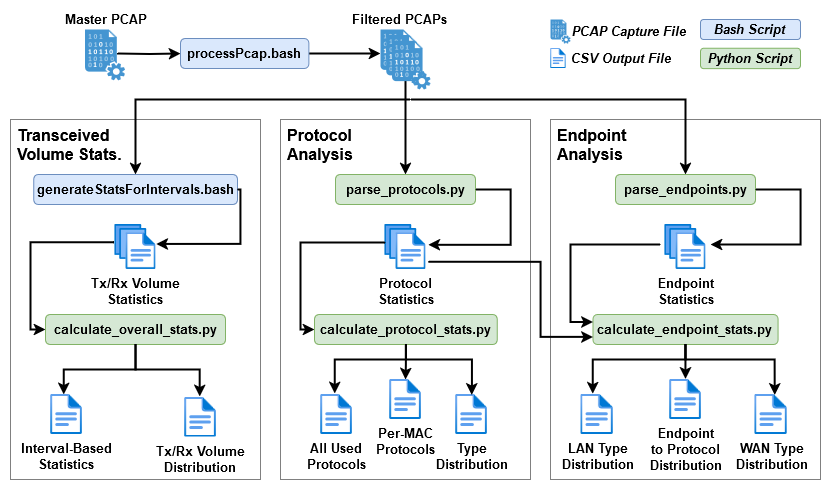

# Smart Home IoT Passive Mode Analysis

## Installing Requirements
The files in this repository were designed to run on a current Linux operating system. The following are required to run the full pipeline:
* Python >= 3.11 (https://www.python.org/)
* Tshark >= 4.2.6 (https://tshark.dev/)

Once the above are acquired, the rest of the requirements can be installed using the requirements.txt file within the python directory of the repository. It is recommended to create a virtual environment with `python -m venv /path/to/env` becore installing python dependencies. 

After creating and activating the virtual environment, install the dependencies within the requirements file using:

`pip install -r requirements.txt`

## Architecture

## Datasets
A list of datasets is given in the [dataset file](datasets.csv), currently this contains a single dataset used within the paper _Your Smart Home Exchanged 3M Messages: Defining and Analyzing Smart Device Passive Mode_. If you have a dataset you wish to add to this project, please follow the instructions in [Contributing to the Datasets](#contributing-to-the-datasets).

## Example Guide Setup
For each section below, example commands are provided for running with the dataset from _Your Smart Home Exchanged 3M Messages: Defining and Analyzing Smart Device Passive Mode_. To setup your environment to follow along with these steps, download the first dataset in [datasets.csv](datasets.csv). Then, ensure your directory tree matches the following:

    └── ~/PercomArtifact
        ├── Passive-Mode-Study/ (this repo)
        ├── Percom116Dataset/ (the unzipped dataset)
        ├── Workspace/ (a working directory for storing results)
    

## Processing and Splitting PCAPs
A master PCAP file can be easily split into smaller, filtered PCAPs using the `processPcap.bash` file in the `bash` directory. It can also only filter on a subset of the whole file by supplying start and end times. The script is run as follows:

    ./processPcap.bash <capture_file> <mac_file> <output_dir> [start_epoch] [end_epoch]

* capture_file - The master capture to filter and split
* mac_file - A mapping of device names to MACs. See the example files in the `bash` directory
* output_dir - A location to store the filtered PCAPs
* start_epoch - (Optional) The start time of the filter subset in seconds since epoch
* end_epoch - (Optional) The end time of the filter subset in seconds since epoch
  
This script creates PCAP files for each filtered with and without DNS for every device. It also creates PCAP files filtered on WAN or LAN traffic per-device for analysis of differing remote and local behaviors.

**NOTE: This script creates numerous copies of parts of the master PCAP file, therefore, roughly 10x the amount of disk space required for the master PCAP is required to store all processed capture files. Please ensure this space exists before running the script.**

An example execution of this script on the original passive mode dataset can be performed with the following command. This command only processes the 2nd network capture event at US1. All other capture events may be processed in the same way.

    > From the bash directory
        ./processPcap.bash ../../Percom116Dataset/US1/US1-Capture2/unfiltered/US1-Capture2.pcap MAC_files_from_paper/US1-MACs.txt ../../Workspace

### Helper Files
Several helper files are available in bash/helpers. While these files are primarily used by `processPcap.bash` to assist with the filtering, they may be run manually on PCAP files if desired. 
* Filtering helper files take the PCAP to filter as a parameter and outputs a filtered PCAP to the same directory as the originating PCAP
* The splitting helper file takes the PCAP to split and a file containing a mapping of names to MACS as in `processPcap.bash`

## Extracting Raw Traffic Volume
TODO

An example execution of this script on the original passive mode dataset can be performed with the following command example command in the previous section has been executed. All other capture events may be processed in the same way.

    > From the bash directory
        ./generateStatsForIntervals.bash ../../Workspace/filtered/no-DNS/per-device MAC_files_from_paper/US1-MACs.txt 3600 "(US1)"

## Extracting Traffic Volume Statistics
TODO

An example execution of this script on the original passive mode dataset can be performed with the following command example command in the previous section has been executed. All other capture events may be processed in the same way.

    > From the python directory
        python3 calculate_overall_stats.py ../bash/output_stats

## Extracting Protocol Statistics
TODO

An example execution of this script on the original passive mode dataset can be performed with the following command example command in the previous section has been executed. All other capture events may be processed in the same way.

## Contributing to the Datasets
